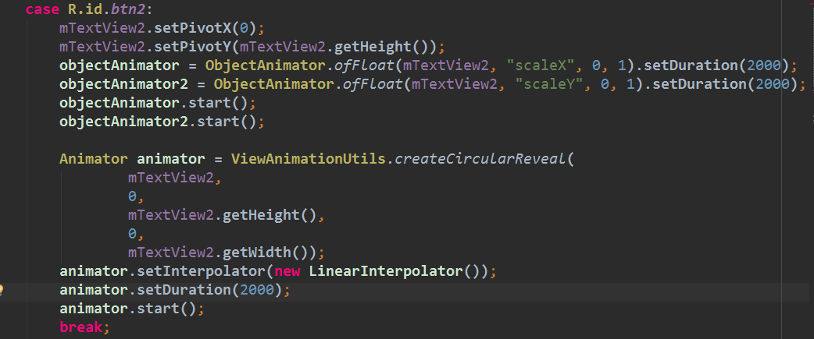
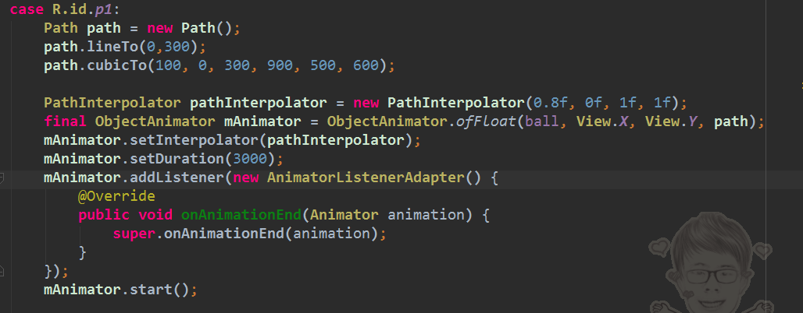
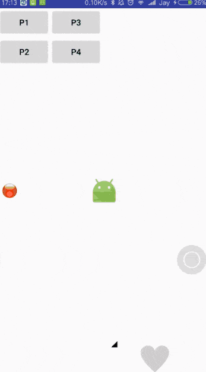

# MaterialDesign
[android-topeka](https://github.com/googlesamples/android-topeka) A fun to play quiz that showcases material design on Android
## 一，Material Design--Animations
### 1,Touch Feedback (触摸反馈)
触摸反馈提供了用户与UI交互时可视化的确认接触点

RippleDrawable类做background，涟漪效果在两种不同的状态间过渡

RippleDrawable(ColorStateList color,Drawable content, Drawable mask)

android:attr/selectableItemBackground 有界限的波纹

android:attr/selectableItemBackgroundBorderless 可以超出视图区域的波纹 (21新添加的api)

#### Use:

### 2,Reveal Effect (揭露效果)
Reveal effect物体出现或消失的动画效果

ViewAnimationUtils.createCircularReveal(View v, int centerX, int centerY, float startRadius, float endRadius)=>Animator

#### Use:

### 3,Activity Transitions ( Activity 切换效果 )
Activity的过渡动画：进入、退出、共享元素下的进、出进出支持这些transition效果：Explode、Slide和Fade

共享元素transition效果：changeBounds、changeClipBounds、changeTransform、changeImageTransform

用Activity.finishAfterTransition()方法,而不是Activity.finish()

#### Use:

### 4,Curved Motion (曲线运动)
自定义动画时间曲线和曲线运动模式

PathInterpolator类是一个新的基于贝塞尔曲线路径的插值器

系统提供了三种基本的曲线：

@interpolator/fast_out_linear_in.xml

@interpolator/fast_out_slow_in.xml

@interpolator/linear_out_slow_in.xml

ObjectAnimator.ofFloat(view, View.X, View.Y, path);

#### Use:

### 5,View State Changes (视图状态改变)
StateListAnimator类定义视图状态变化时的动画效果

layout：android:stateListAnimator

AnimationInflater.loadStateListAnimator()

View.setStateListAnimator()

#### Use:

AnimatedStateListDrawable

#### Use:

### 6,Animate View Drawables (可绘矢量动画)
VectorDrawable矢量图片伸缩不失真

AnimatedVectorDrawable矢量图动画

矢量图动画通常包括三类xml文件：

<vector>矢量图，在res/drawable/

<animated-vector>矢量图，在res/drawable/

用<objectAnimator>元素，在res/anim/
  
#### Use:

### Screenshot

## 二，Material Design--CoordinatorLayout

### Screenshot

## 三，Material Design--Custom Behavior

### Screenshot

